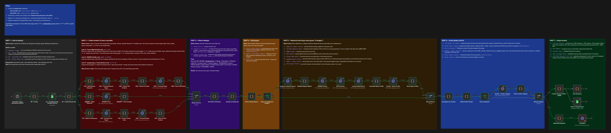
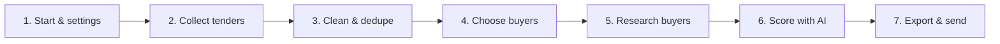
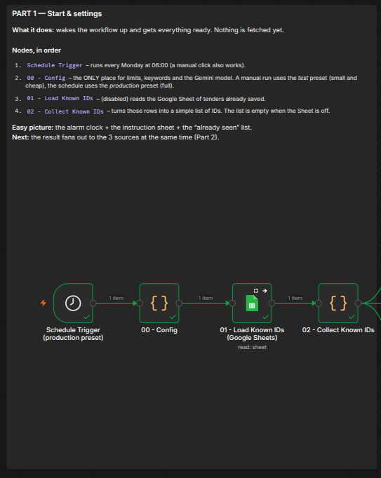
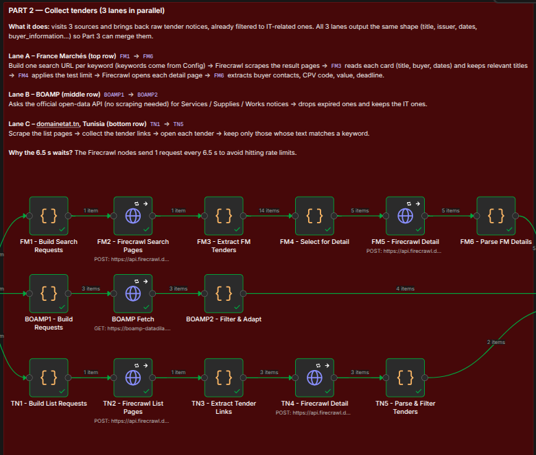
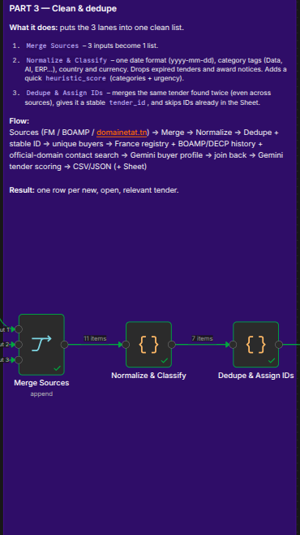
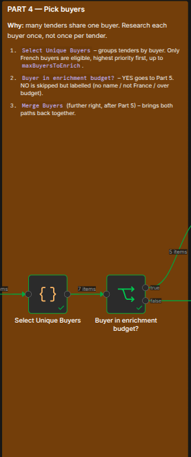
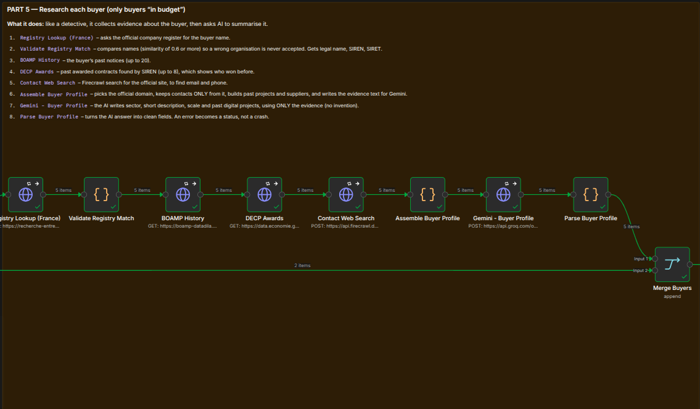
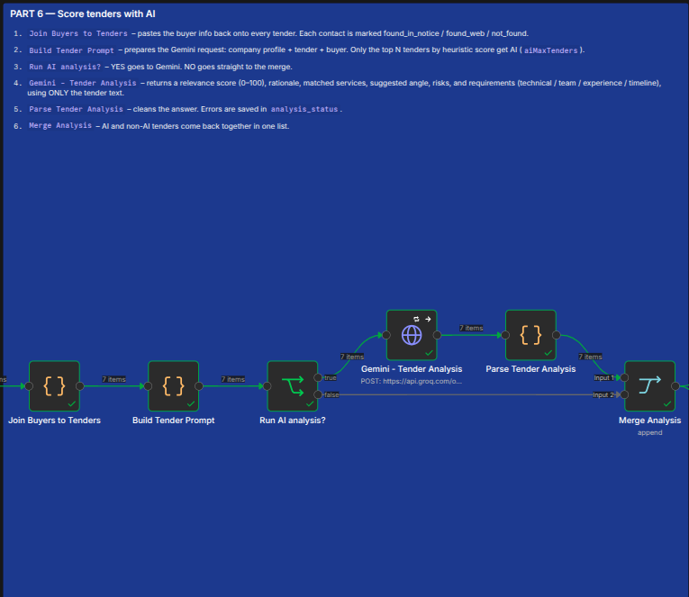
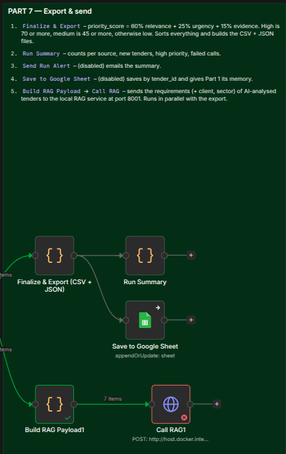

# Multi-Source RFP Pipeline

An n8n workflow that finds public tenders (RFPs), researches the buyers, scores each tender with AI, and gives you a ranked CSV file every week.

**In one sentence:** it replaces hours of manual portal checking with one file that tells you which tenders to answer first.



---

## The big picture



| Part | What it does | Main tools |
|------|--------------|-----------|
| 1 | Starts the run and loads the settings | n8n, Google Sheets (optional) |
| 2 | Gets tenders from 3 websites | Firecrawl, BOAMP API |
| 3 | Cleans the data and removes duplicates | n8n code |
| 4 | Picks which buyers to research | n8n code |
| 5 | Builds a profile for each buyer | French registry, BOAMP, DECP, Firecrawl, Gemini |
| 6 | Scores each tender | Gemini |
| 7 | Exports the results | CSV, JSON, RAG service |

---

## Part 1: Start and settings

This is the "wake up and get ready" part. Nothing is fetched yet.

```
Schedule Trigger  →  00 - Config  →  01 - Load Known IDs  →  02 - Collect Known IDs
   (Monday 6 am)      (limits)         (Google Sheet)           (list of seen IDs)
```



**What happens**

- The trigger starts the workflow every Monday at 6 am.
- `00 - Config` is the only place with settings: keywords, limits, and the Gemini model.
- `01 - Load Known IDs` reads the tenders we already saved in a Google Sheet.
- `02 - Collect Known IDs` turns them into a simple list of IDs.

**Test or production?**

The workflow picks a preset by itself:

- Manual run → **test** preset (small and fast).
- Scheduled run → **production** preset (full).

| Setting | Test | Production |
|---------|------|-----------|
| France Marchés keywords | 1 | all |
| France Marchés pages per keyword | 1 | 2 |
| France Marchés detail pages | 5 | all |
| BOAMP pages per type | 1 | 3 |
| Tunisia list pages | 1 | 3 |
| Tunisia detail pages | 3 | all |
| Buyers to research | 5 | 60 |
| Tenders for AI scoring | 10 | all |

---

## Part 2: Collect tenders

Three sources, three lanes. Each lane follows the same idea: build the requests, get the data, keep the useful fields.

```
France Marchés:  FM1 Build searches → FM2 Scrape results → FM3 Find tenders → FM4 Limit → FM5 Scrape details → FM6 Parse

BOAMP:           BOAMP1 Build requests → BOAMP Fetch (API) → BOAMP2 Filter & adapt

domainetat.tn:   TN1 Build list URLs → TN2 Scrape list → TN3 Get links → TN4 Scrape details → TN5 Parse & filter
```



**What happens**

- **France Marchés:** one search per keyword, then we open each tender page to get the buyer, the dates and the contacts.
- **BOAMP:** we call the open-data API. No scraping needed.
- **domainetat.tn:** we scrape the list page, collect the links, then open each tender.
- Every lane has a **relevance gate**: if the tender is not about IT, it is dropped.

**Good to know**

- Firecrawl calls wait 6.5 seconds between each other. This protects the API limit, but it makes full runs slow.

---

## Part 3: Clean and dedupe

Three different formats go in. One clean list comes out.

```
Merge Sources  →  Normalize & Classify  →  Dedupe & Assign IDs
 (3 lists → 1)      (same format)           (one ID per tender)
```



**What happens**

1. **Merge:** the three lists become one.
2. **Normalize & Classify:**
   - all dates become `yyyy-mm-dd`
   - expired tenders are dropped
   - award notices are dropped
   - each tender gets categories (Data, AI, CRM, ERP...)
   - each tender gets a quick `heuristic_score` (categories + urgency)
3. **Dedupe & Assign IDs:**
   - the same tender found twice is merged into one
   - each tender gets a stable ID like `T-1a2b3c...`
   - tenders whose ID is already in the Google Sheet are skipped

**Why the stable ID matters**

The ID is built from the title, the buyer and the deadline. So the same tender always gets the same ID, even if it comes from two websites.

---

## Part 4: Choose buyers

Many tenders come from the same buyer. We research each buyer only once.

```
Select Unique Buyers  →  Buyer in enrichment budget?
 (1 record per buyer)         │
                              ├─ yes → Part 5 (research) ─┐
                              └─ no  → skip (labelled) ───┴→ Merge Buyers
```



**What happens**

- `Select Unique Buyers` groups the tenders by buyer and keeps the contacts already found in the notices.
- Only **French buyers** can be researched, because the registry is French.
- Buyers are sorted by priority. Only the top N go to Part 5 (N = `maxBuyersToEnrich`).
- The other buyers are **never deleted**. They get a clear label:

| Label | Meaning |
|-------|---------|
| `queued` | will be researched |
| `not_attempted_budget` | French buyer, but outside the top N |
| `skipped_country_Tunisia` | not a French buyer |
| `skipped_no_buyer_name` | the buyer name is missing |

---

## Part 5: Research each buyer

A small investigation for each buyer, in 8 steps.

```
Registry Lookup → Validate Match → BOAMP History → DECP Awards
                                                       │
Parse Buyer Profile ← Gemini Buyer Profile ← Assemble Profile ← Contact Web Search
```



**What happens**

| Step | Node | What it does |
|------|------|--------------|
| 1 | Registry Lookup | Searches the buyer in the French company registry |
| 2 | Validate Registry Match | Compares names. Below 0.6 similarity = rejected |
| 3 | BOAMP History | Finds the buyer's past notices |
| 4 | DECP Awards | Finds past contracts and suppliers (by SIREN number) |
| 5 | Contact Web Search | Searches the official website for email and phone |
| 6 | Assemble Buyer Profile | Puts all the evidence together |
| 7 | Gemini - Buyer Profile | AI writes a short profile |
| 8 | Parse Buyer Profile | Cleans the AI answer |

**Safety rules**

- Contacts are taken **only from the official website** (or the service-public directory).
- Gemini uses **only the evidence we give it**. If there is not enough evidence, it returns `null`.
- The registry's first result is **never accepted blindly**. The name must match.

---

## Part 6: Score with AI

Now we connect the buyer information back to each tender, and Gemini scores it.

```
Join Buyers to Tenders → Build Tender Prompt → Run AI analysis?
                                                   │
                                                   ├─ yes → Gemini Tender Analysis → Parse ─┐
                                                   └─ no  ─────────────────────────────────┴→ Merge Analysis
```



**What happens**

- `Join Buyers to Tenders` adds the buyer profile and contacts to every tender.
- `Build Tender Prompt` writes the prompt. It includes our company profile and the tender text.
- `Run AI analysis?` limits the cost: only the top N tenders (by `heuristic_score`) go to Gemini.
- Gemini returns:

| Field | Meaning |
|-------|---------|
| `relevance_score` | 0 to 100 |
| `relevance_rationale` | why this score |
| `matched_service_lines` | our services that fit |
| `suggested_angle` | how to approach the client |
| `risks` | what could go wrong |
| `requirements` | technical, team, experience, timeline |

**Safety rule**

Gemini must use only the tender text. It must never invent a requirement.

---

## Part 7: Export and send

Everything is ready. We rank the tenders and send them out.

```
Merge Analysis ─┬→ Finalize & Export (CSV + JSON) ─┬→ Run Summary → Send Run Alert (optional)
                │                                   └→ Save to Google Sheet (optional)
                │
                └→ Build RAG Payload → Call RAG
```



**The priority score**

```
priority_score = 60% relevance + 25% urgency + 15% evidence
```

- **Relevance:** the Gemini score (or the quick heuristic score if the AI did not run).
- **Urgency:** a deadline in 4 to 14 days gets the best urgency points.
- **Evidence:** how well we know the buyer (identified? email? phone? website?).

| Score | Priority |
|-------|----------|
| 70 or more | high |
| 45 to 69 | medium |
| below 45 | low |

**Outputs**

| Output | Description |
|--------|-------------|
| `tenders_master_<date>.csv` | One row per tender, sorted by priority |
| `tenders_master_<date>.json` | Same data, full structure |
| Run Summary | Counts per source, new tenders, high priority, failed calls |
| Google Sheet *(optional)* | Saves rows by `tender_id`. This is the workflow's memory |
| Email alert *(optional)* | Sends the run summary |
| RAG call | Sends the tender requirements to the RAG service |

**The RAG call**

For each tender with AI requirements, the workflow sends this to `http://host.docker.internal:8001/retrieve/tender`:

```json
{
  "tender_id": "...",
  "client": "...",
  "sector": "...",
  "requirements": { "technical": [], "team": [], "experience": [] }
}
```

---

## Setup

**1. Create two Header Auth credentials in n8n**

| Credential | Header name | Value |
|------------|-------------|-------|
| Firecrawl API | `Authorization` | `Bearer fc-...` |
| Gemini API | `x-goog-api-key` | your Gemini key |

No API key is stored inside any node.

**2. Edit the settings**

Open `00 - Config` and change the keywords, limits, company profile and Gemini model.

**3. Enable the memory (recommended)**

Enable these two nodes and set your real Google Sheet ID in both:

- `01 - Load Known IDs (Google Sheets)`
- `Save to Google Sheet`

Create a sheet tab named `tenders` with a `tender_id` column.

Without them, the workflow forgets everything and processes all tenders again each week.

**4. Optional extras**

- Enable `Send Run Alert` and set the sender and receiver emails.
- Start your RAG service on port `8001`, or disable `Call RAG1`.

---

## Good to know

- **First run:** use test mode (run it manually). It is fast and cheap.
- **Memory saves money:** the known-ID check happens in the Dedupe step. It saves the buyer research, the web searches and the Gemini calls. The first page scraping still runs.
- **Slow by design:** the waiting time between Firecrawl calls protects the API limits.
- **Unverified assumptions:** if a source returns nothing, check these first:
  - the page parameter on France Marchés (`page`)
  - the page parameter on domainetat.tn (`paged`)
  - the DECP supplier field names
- **Nothing is hidden:** failed calls are counted in the Run Summary, and skipped buyers keep a status label.

---

## Folder structure

```
.
├── README.md
├── Multi-Source_RFP_Pipeline__Final_.json
└── assets/
    ├── overview.png
    ├── part1_start_and_settings.png
    ├── part2_collect_tenders.png
    ├── part3_clean_and_dedupe.png
    ├── part4_choose_buyers.png
    ├── part5_research_each_buyer.png
    ├── part6_score_with_ai.png
    └── part7_export_and_send.png
```
