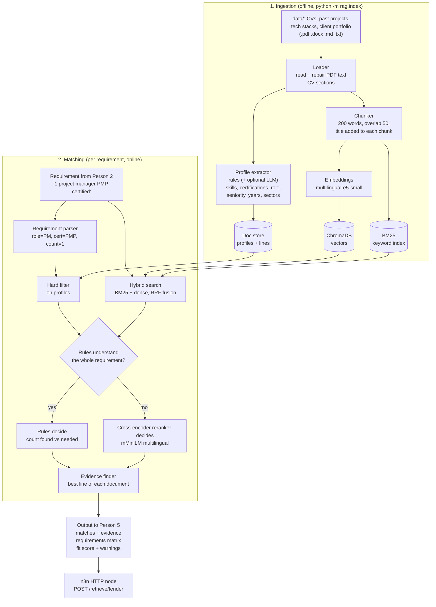

# RAG Architecture: Evidence-Based Requirement Matching

**Owner:** Person 4 (RAG retrieval + benchmark)
**Position in the pipeline:** Person 2 (tender extraction) → **RAG** → Person 5 (proposal).
Person 1's n8n workflow calls it over HTTP.

## The idea in one sentence

For every tender requirement, find the OliveSoft people, projects and stacks that meet it,
**prove it with a quote from the source document**, and say clearly whether the requirement
is *covered*, *partial* or *missing*.

Why this design: a sales manager cannot send a proposal that says "we have a PMP project
manager" unless it is true. Plain vector search finds *similar* documents. It cannot check
hard facts like certifications, seniority or "at least 3 people". So we combine vector search
with structured rules, and check the rest with a reranker.

## Diagram

Images: `docs/architecture.png` (tall, for the report) and `docs/architecture_wide.png` (wide, for slides).



## Components

| Step | File | What it does | Why |
|---|---|---|---|
| Loader | `rag/loader.py` | Reads .pdf, .docx (with tables), .md, .txt. Repairs PDF text broken by the export (split accents, `¿` for `>`, bullet symbols). Skips empty, scanned or broken files with a message. | Real CVs are PDF or Word files. |
| CV reader | `rag/cvparse.py` | Real CVs have no labelled lines. Finds the sections (Profile, Experience, Skills, Certifications; English and French), the name, the current job ("… – Present") and the years worked (from the job dates, internships not counted). The title becomes "Name - current job". | The 19 sample OliveSoft CVs are PDFs made with LaTeX. |
| Chunker | `rag/loader.py` | 200-word chunks, 50 overlap, title in each chunk. | Long CVs stay searchable. |
| Profile extractor | `rag/profiles.py` | Turns each document into fields: skills, certifications, role, seniority, years, sectors. Works on labelled mock files and on real CVs. A certification counts only if it is in the Certifications line or section. Years: written ("over three years") or counted from the job dates; dates alone never make someone senior. Rules by default; any OpenAI-compatible LLM can be added. | Hard facts need exact checks, not similarity. |
| Vocabulary | `rag/taxonomy.py` | English + French names for about 100 skills, 30 certifications, 20 roles, 8 sectors, plus implied skills (Talend → ETL, Databricks → Spark). The index is rebuilt automatically when this file changes. | Tenders are in French, documents often in English. |
| Vector index | `rag/index.py` | `multilingual-e5-small` embeddings in ChromaDB. | Best model in our benchmark, strong on French, fast on CPU. |
| Keyword index | `rag/hybrid.py` | BM25 with French/English stop words and alias expansion. | Catches exact terms like "PostgreSQL" or "ISO 27001". |
| Fusion | `rag/hybrid.py` | Reciprocal Rank Fusion: `score = Σ 1/(60 + rank)`. | Merges two ranked lists without tuning score scales. |
| Requirement parser | `rag/reqparse.py` | Sentence → skills, certifications, role, seniority, minimum count, mandatory or optional, AND or OR. Two skills without "or" or a list need both ("Tableau dashboards"). Certificate names are not read as job titles ("Power BI Data Analyst (PL-300)"). | "Minimum 3 senior developers" must return 3 senior people. |
| Decision | `rag/retriever.py` | Rules decide when they explain every word. Otherwise a document counts only if the reranker is confident (score ≥ 0), or if the words unknown to the rules appear in its text (score ≥ -6). | Rules are exact but only know their vocabulary. The unknown words are usually the specific part ("iOS", "Swift"), so they must be proven too. |
| Reranker | `rag/index.py` | `cross-encoder/mmarco-mMiniLMv2-L12-H384-v1` reads the requirement and the document together. For a long CV it reads the title, the summary and the lines that mention the requirement. | Cosine scores are packed too close to say "we do not have this". |
| Evidence | `rag/retriever.py` | Picks the line that proves the match (keyword hits, certificate lines first, then reranker). | Every claim in the proposal has a source. |
| API | `rag/api.py` | FastAPI: `/retrieve`, `/retrieve/tender`, `/match`, `/reindex`, `/health`. | n8n calls it with one HTTP node. |
| Dashboard | `rag/ui/index.html`, `rag/dashboard.py`, `app.py` | One-file web page (no internet needed) + `/api/...` endpoints: examples, documents, uploads, benchmark results, background jobs for tests and the benchmark. `app.py` starts everything and opens the browser. | Use and demo the system without a terminal. |

## Dashboard and safety

- The server listens on `127.0.0.1` only. Uploads accept `.pdf`, `.docx`, `.md`, `.txt` up to 15 MB,
  are checked for readable text **before** indexing, and are saved in `data/uploads/`.
  Only uploaded files can be deleted from the dashboard.
- A read/write lock lets many matching requests run together, while a rebuild waits for them.
- A rebuild fills a new collection first and swaps it in at the end, so the service never loses its index.
- Caches reload when the index files change, so a rebuild from another window is picked up.
- "Run tests" runs pytest in the background on a private copy of `data/` (see `tests/conftest.py`);
  "Run benchmark" runs the quick benchmark on the live index.
- Both models are loaded at startup; when they are already on disk, `app.py` turns on offline mode.

## Output contract

The `matches` list keeps the exact format from the team task file
(`doc_id`, `type`, `similarity_score`, `summary`). We added fields; we removed none.

```json
{
  "matches": [{"doc_id": "CV_Sami_Trabelsi.md", "type": "cv", "similarity_score": 0.88,
               "summary": "PMP-certified project manager, 10 years...",
               "evidence": {"quote": "Certifications: PMP (Project Management Professional, PMI), PRINCE2 Foundation", "line": 2},
               "supports": "1 project manager PMP certified"}],
  "requirements_matrix": [{"requirement": "1 project manager PMP certified", "status": "covered",
                           "found": 1, "needed": 1, "method": "rules",
                           "best_doc": "CV_Sami_Trabelsi.md", "evidence": "Certifications: PMP ...",
                           "closest_doc": null}],
  "fit_score": {"technical_fit": 100, "experience_fit": 100, "team_fit": 100,
                "domain_fit": 100, "certification_fit": 100, "overall": 100},
  "warnings": ["BLOCKING - no internal evidence for mandatory requirement(s): ..."]
}
```

- **Fit score:** each requirement gives 0–100. Rules give `found / needed`; the reranker score is mapped to 0–100. Optional requirements ("preferred") count half. It measures coverage (do we have proof?), not quality, so a tender fully proven by the rules scores 100.
- **Warnings:** empty categories, unknown sector, missing mandatory requirement (BLOCKING), partial coverage.

## Edge cases handled

| Case | Behaviour |
|---|---|
| Empty or missing requirement list | Skipped, warning, that fit score is `null` |
| Requirement given as a string instead of a list | Accepted |
| Requirement OliveSoft cannot meet (blockchain, Salesforce) | `missing`, BLOCKING warning, nearest document shown separately as `closest_doc` (never as a match) |
| Not enough people ("5 senior developers", we have 4) | `partial`, "found 4 of 5" |
| AND vs OR ("Kubernetes and Terraform") | AND needs both skills in the same document |
| Similar but wrong person (Scrum Master for "PMP") | Rejected by the certification rule |
| Unknown words in a requirement | Rules step back; the reranker decides, and the unknown words must appear in the document unless the reranker is confident |
| Generic part matches, specific part does not ("Senior iOS Swift developer") | `missing`: senior web developers are not proposed |
| Empty, scanned or broken file | Skipped at indexing with a log line |
| Two files with the same name in different folders | Second one skipped with a log line |
| Tender record without `requirements` | Accepted; all categories reported as empty |
| LLM extractor down or not configured | Rules-only profiles; indexing never fails |
| PDF made with LaTeX ("Facult´ e", `¿15TB`, bullet symbols) | Text repaired before indexing. Text the PDF lost (after an unescaped `%`) cannot come back |
| Same name on several CVs (the sample CVs reuse 11 names for 20 people) | `doc_id` is the file name; the title shows "Name - current job" |
| Certificate mentioned in the experience, not in the Certifications section | Not counted (CV 02 mentions ISO 27001 work) |
| Old job title ("was a DevOps engineer, now a delivery manager") | The role comes from the current job |
| Years not written in the CV | Counted from the job dates, without internships; never "senior" from dates alone |

## Results (see `benchmark/results.md`)

- Model choice: `multilingual-e5-small` is the only model with 100% Hit@1 in both English and French.
- Coverage decisions (has / has not): 75% with a similarity threshold, 100% with the final system.
- The benchmark has its own indexes (`benchmark/.index/`): parts 1-3 always run on the mock data,
  so adding real documents to `data/` never changes those numbers.
- Hard constraint tests: 3/19 with a similarity threshold, 19/19 with the final system.
- Unseen requirements, never used for tuning: 12/20 with a similarity threshold, 19/20 with the final system.
  The other sets include a few cases added after we saw them fail, so the unseen set is the honest number.
  (The vocabulary added for the real CVs also fixed the one unseen miss, "Terraform infrastructure as code",
  so the benchmark now shows 20/20; since we had seen that miss, we keep 19/20 as the honest number.)
- Real CVs: 40/42 checks pass on the 19 sample OliveSoft PDF CVs (similarity baseline: 8/42)
  (certificates, roles, counts, seniority, things nobody has). These checks were written after we added
  their vocabulary, so they show that the system reads real PDF CVs, not that it handles unseen words.

## Next steps (Phase 2)

1. Retry loop: when a requirement comes back `missing`, rewrite the query (synonyms, FR↔EN) and try again.
2. Team builder: choose one team that covers all requirements, each person used once.
3. Faster uploads: reindex only the new file instead of the whole knowledge base.
4. Real OliveSoft documents and a larger test set (100+ queries).
