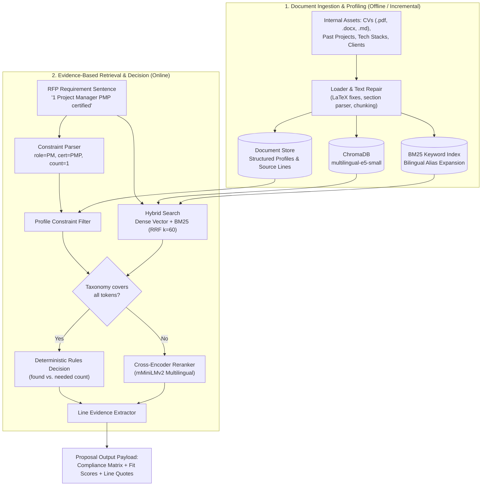

# OliveSoft Evidence-Based RAG Retrieval Service

**RFP Intelligence & Commercial Proposal Knowledge Retrieval Engine**

An evidence-based knowledge retrieval and constraint satisfaction engine designed for automated tender intelligence. Given complex RFP requirements, the engine audits organizational assets (consultant CVs, past project records, technical capabilities, client portfolios) to provide verifiable compliance proofs:

* **Line-Level Evidence:** Direct quotes and document references for every claimed qualification.
* **Requirements Compliance Matrix:** Automated categorization into **Covered**, **Partial**, or **Missing**.
* **Composite Fit Scoring:** Granular readiness metrics (Technical, Experience, Team, Domain, Certification, and Overall).
* **Deterministic Constraint Checking:** Strict validation of roles, seniority, certifications, team headcounts, and boolean logic (AND/OR).
* **Self-Contained Dashboard & API:** Ready-to-use interactive web UI and high-throughput FastAPI endpoints for pipeline integration.

---

## Why Standard Vector Search Fails for RFPs

In public tenders, claiming qualifications without verifiable proof leads to disqualification or legal liabilities. Vanilla semantic embeddings alone cannot guarantee compliance:

| Challenge | Standard Vector Search (Cosine Similarity) | OliveSoft Hybrid RAG Retrieval Engine |
|---|---|---|
| **Hard Boolean Constraints** | Fails. Matches "Senior Developer" even if requirement asks for "Minimum 3". | **Parsed into strict constraints** (`min_count=3`, `seniority=senior`). |
| **Certifications vs. Experience** | Confuses experience with credentials (e.g., Scrum Master matched to "PMP"). | **Isolated section parsing**; credentials must exist in certified sections. |
| **Negative Rejection** | Returns nearest irrelevant document with high score (18% negative rejection). | **100% negative rejection**; missing skills trigger warnings and separate `closest_doc`. |
| **Attribution & Auditing** | Returns generic document chunks without attribution. | **Extracts exact quote and line number** directly cited in proposals. |
| **Multilingual Terminology** | Inconsistent matching across French tenders and English resumes. | **Bilingual taxonomy + multilingual-e5 embeddings + BM25 alias expansion**. |

---

## Architecture & Processing Pipeline



### The 5-Stage Processing Engine

1. **Ingestion & Text Sanitization (`rag/loader.py`, `rag/cvparse.py`):**
   * Ingests `.pdf`, `.docx`, `.md`, and `.txt` files.
   * Cleans real-world export artifacts (LaTeX ligature restoration, split accents, broken symbols like `¿15TB`).
   * Parses CV sections (Profile, Experience, Skills, Certifications) and counts professional years excluding internships.
2. **Constraint Extraction (`rag/reqparse.py`):**
   * Deconstructs requirement sentences into structured criteria: target roles, seniority thresholds, headcounts, required certifications, domain sectors, and mandatory vs. optional flags.
   * Enforces boolean constraints (`Kubernetes and Terraform` requires both in the same profile).
3. **Hybrid Search & Fusion (`rag/hybrid.py`):**
   * Dense semantic embeddings via `intfloat/multilingual-e5-small` in ChromaDB.
   * BM25 lexical ranking with French/English stopword filtering and synonym expansion.
   * Reciprocal Rank Fusion (RRF with $k=60$) balances keyword precision with semantic depth.
4. **Dual-Track Decision Engine (`rag/retriever.py`):**
   * **Deterministic Rule Track:** When all terms map to canonical taxonomy entries, coverage is evaluated strictly on verified profile attributes.
   * **Cross-Encoder Reranker Track:** When specialized or unseen vocabulary appears (e.g., niche frameworks), `cross-encoder/mmarco-mMiniLMv2-L12-H384-v1` scores targeted document passages with lexical validation.
5. **Evidence Attribution & Fit Scoring (`rag/retriever.py`):**
   * Extracts the exact source line and quote supporting the decision (weighting certification lines 3×).
   * Calculates category-specific and overall readiness scores (0–100%), factoring optional requirements at 0.5×.

---

## Quick Start

### Prerequisites
* **Python 3.10+**
* ~1 GB free disk space (models cache locally on first run)

### Single-Command Launch

| Platform | Command |
|---|---|
| **Linux / macOS** | `./start.sh` |
| **Windows** | `.\start.bat` |

*The initial launch automatically creates the virtual environment, installs dependencies, downloads models, builds the index, and launches the browser dashboard at `http://127.0.0.1:8001`.*

### Manual Terminal Setup

```bash
# 1. Initialize environment
python3 -m venv .venv
source .venv/bin/activate       # Windows: .venv\Scripts\activate

# 2. Install dependencies
pip install -r requirements.txt

# 3. Start service and dashboard
python app.py
```

### Run Command-Line Demo

Test requirement evaluation directly from the terminal:

```bash
# Run baseline tender check
python demo.py

# Test tender with hard constraint edge cases
python demo.py examples/tender_hard.json

# Custom tender specification with custom output path
python demo.py --tender path/to/tender.json --output results.json
```

---

## Interactive Web Dashboard

The service includes an offline-capable browser interface at **`http://127.0.0.1:8001`**:

* **Tender Compliance Matcher:** Input multi-line requirements or paste an extraction payload to view the complete compliance matrix, score distribution, and downloadable proposal JSON / CSV exports.
* **Single Requirement Inspector:** Test individual sentences in real time. Visualizes parsed constraints, decision routing (Rules vs. Cross-Encoder), unrecognized tokens, and supporting text quotes.
* **Knowledge Base Explorer:** Inspect indexed consultant profiles, past projects, and capabilities. Supports drag-and-drop document upload (`.pdf`, `.docx`, `.md`) with instant re-indexing.
* **Benchmark & Verification Suite:** Run the automated test suite and empirical benchmark directly from the UI with real-time progress monitoring.

---

## Integration & REST API

The service exposes a FastAPI backend conforming to OpenAPI standards (`http://127.0.0.1:8001/docs`).

### Endpoints

| Method | Path | Payload | Description |
|---|---|---|---|
| `GET` | `/health` | None | Healthcheck, model readiness, and index status. |
| `POST` | `/retrieve/tender` | Full Tender Record | **Primary endpoint for orchestration pipelines (e.g. n8n).** |
| `POST` | `/retrieve` | Requirements Object | Match technical, team, and experience requirement lists. |
| `POST` | `/match` | Single Requirement | Unit evaluation of an individual requirement sentence. |
| `POST` | `/reindex` | None | Trigger atomic index rebuild. |

### Pipeline Payload Schema

**Input Payload (from Upstream RFP Extraction):**
```json
{
  "tender_id": "TN-2026-0847",
  "client": "Ministère du Tourisme",
  "sector": "Public Sector / Government",
  "requirements": {
    "technical": ["React or Angular frontend", "PostgreSQL database"],
    "team": ["Minimum 3 senior developers", "1 project manager PMP certified"],
    "experience": ["2+ previous public sector digital projects", "ISO 27001 preferred"]
  }
}
```

**Output Payload (to Downstream Proposal Generation):**
```json
{
  "matches": [
    {
      "doc_id": "CV_Sami_Trabelsi.md",
      "type": "cv",
      "similarity_score": 0.88,
      "summary": "PMP-certified project manager with 10 years experience...",
      "evidence": {
        "quote": "Certifications: PMP (Project Management Professional, PMI), PRINCE2 Foundation",
        "line": 2
      },
      "supports": "1 project manager PMP certified"
    }
  ],
  "requirements_matrix": [
    {
      "requirement": "1 project manager PMP certified",
      "category": "team",
      "mandatory": true,
      "status": "covered",
      "found": 1,
      "needed": 1,
      "method": "rules",
      "best_doc": "CV_Sami_Trabelsi.md",
      "evidence": "Certifications: PMP (Project Management Professional, PMI)...",
      "closest_doc": null,
      "percent": 100
    }
  ],
  "fit_score": {
    "technical_fit": 100,
    "experience_fit": 100,
    "team_fit": 100,
    "domain_fit": 100,
    "certification_fit": 100,
    "overall": 100
  },
  "warnings": []
}
```

---

## Empirical Benchmark Results

Evaluated across 40 bilingual queries (EN/FR), 17 negative requirements, 19 hard constraint edge cases, 20 unseen requirements, and 42 checks on real PDF resumes (see [benchmark/results.md](benchmark/results.md)):

| Benchmark Metric | Baseline (Vector Similarity Threshold) | OliveSoft Hybrid RAG Retrieval Engine |
|---|:---:|:---:|
| **Hard Constraint Tests Passed** | 3 / 19 (15.7%) | **19 / 19 (100%)** |
| **Negative Capability Rejection** | 18% rejection (75% acc) | **100% rejection (100% acc)** |
| **Unseen Requirements (Honest Test)** | 12 / 20 (60.0%) | **19 / 20 (95.0%)** |
| **Real PDF Resume Evaluation (42 checks)** | 8 / 42 (19.0%) | **40 / 42 (95.2%)** |
| **Embedding Retrieval Speed** | BGE-M3: 165 ms/query | **multilingual-e5-small: 24 ms/query (~7× faster)** |

---

## Directory Organization

```text
RAG/
├── start.bat / start.sh       Automated one-click startup scripts
├── app.py                     Application entrypoint (HTTP service + browser manager)
├── demo.py                    CLI requirement matching tool
├── requirements.txt           Production dependencies
├── pytest.ini                 Pytest test runner configuration
├── ARCHITECTURE.md            In-depth architectural design specification
├── rag/                       Core Retrieval Service
│   ├── api.py                 FastAPI application and REST endpoints
│   ├── config.py              Runtime settings and model hyperparameters
│   ├── cvparse.py             Unstructured CV parser (sections, dates, seniority)
│   ├── dashboard.py           Dashboard API (uploads, job queue, background tasks)
│   ├── hybrid.py              Hybrid BM25 + dense vector ranking via RRF
│   ├── index.py               ChromaDB vector collection manager & atomic swapping
│   ├── loader.py              Multi-format document reader and text repair
│   ├── profiles.py            Structured document profile extractor
│   ├── reqparse.py            Natural language requirement constraint parser
│   ├── retriever.py           Evidence-based compliance matching & scoring
│   ├── taxonomy.py            Bilingual skill, role, certification, sector vocabulary
│   └── ui/index.html          Zero-dependency reactive web dashboard
├── data/                      Knowledge Base Documents
│   ├── cvs/                   Structured consultant CVs (.md)
│   ├── olivesoft_cvs/         Sample PDF CVs compiled from LaTeX
│   ├── projects/              Past project records (.md)
│   ├── tech_stacks/           Core technical capability profiles (.md)
│   └── clients/               Client portfolio and sector references (.md)
├── benchmark/                 Evaluation Engine & Datasets
│   ├── run_benchmark.py       Automated benchmark runner
│   ├── results.md             Detailed empirical evaluation findings
│   └── results.json           Serialized metric records
└── tests/                     Automated Test Suite
    ├── conftest.py            Isolated temporary test environment fixture
    ├── test_rag.py            Core retrieval & parser unit tests
    ├── test_real_cvs.py       Real PDF resume parsing regression tests
    └── test_dashboard.py      API endpoint integration tests
```

---

## Verification & Testing

Execute the automated test suite against an isolated temporary knowledge base copy:

```bash
python -m pytest tests/
```
*53 passing unit and integration tests covering requirement parsing, boolean logic, hybrid fusion, PDF repair, date computation, and API endpoints.*
