# TendOlive: Automated RFP Intelligence & Proposal Generation

**CSTAM 3.0 Enterprise Bid Intelligence Platform**

TendOlive is an automated end-to-end RFP intelligence pipeline designed to monitor, extract, match, and respond to public procurement tenders. The system streamlines bid qualification by combining automated web scraping and buyer enrichment via n8n with an evidence-based hybrid RAG retrieval engine.

---

## System Architecture

```mermaid
flowchart LR
    subgraph SOURCES["1. Multi-Source Tender Ingestion"]
        FM["France Marchés<br/>(Firecrawl Scraper)"]
        BOAMP["BOAMP Open Data<br/>(API & Detail Crawl)"]
        TN["domainetat.tn<br/>(Tunisia Procurement)"]
    end

    subgraph ORCH["2. n8n Orchestration Pipeline"]
        COLLECT["Collect & Deduplicate Tenders"]
        ENRICH["Buyer Intelligence<br/>(SIRENE Registry + Gemini)"]
        EXTRACT["Requirement Extraction<br/>(Structured Criteria with Gemini)"]
        PAYLOAD["Construct RAG Request Payload"]
    end

    subgraph RAG_SRV["3. Evidence-Based RAG Engine (RAG/)"]
        API["FastAPI Engine<br/>POST /retrieve/tender"]
        PARSER["Constraint Parser<br/>(Roles, Certs, Seniority, Count)"]
        HYBRID["Hybrid Search & Reranker<br/>(multilingual-e5 + BM25 + mMiniLMv2)"]
        DECISION["Compliance Matrix<br/>(Covered / Partial / Missing)"]
        EVIDENCE["Evidence Quotations<br/>(Line-level document citations)"]
    end

    subgraph OUTPUT["4. Proposal Strategy & Export"]
        MERGE["Merge Compliance & Fit Scores"]
        PROPOSAL["Commercial Proposal Synthesis<br/>(Audit-Ready Evidence Citing)"]
        EXPORT["Final Export<br/>(Google Sheets / CSV / JSON)"]
    end

    FM --> COLLECT
    BOAMP --> COLLECT
    TN --> COLLECT
    COLLECT --> EXTRACT --> PAYLOAD
    EXTRACT --> ENRICH
    PAYLOAD --> API
    API --> PARSER --> HYBRID --> DECISION --> EVIDENCE
    EVIDENCE --> MERGE
    MERGE --> EXPORT
    MERGE -.-> PROPOSAL
```



---

## Core Capabilities

1. **Automated Multi-Source Procurement Scraping:**
   * Automated monitoring of French and Tunisian tender platforms (BOAMP, France Marchés, domainetat.tn).
   * Intelligent deduplication and normalization of buyer records and solicitation notices.

2. **Buyer Intelligence & LLM Requirement Extraction:**
   * Enriches institutional buyers against official business registries and procurement history.
   * Extracts structured technical, team, and experience constraints using specialized prompts.

3. **Evidence-Based Hybrid Retrieval ([RAG/](RAG/)):**
   * Audits organizational assets (consultant CVs, technical capabilities, client portfolios, past projects).
   * Enforces hard constraints (headcount minimums, PMP/ISO certifications, senior experience thresholds).
   * Generates exact document quotations and line references so proposals contain zero hallucinations.
   * Computes multi-dimensional readiness scores (Technical, Experience, Team, Domain, Certification, Overall).

4. **Self-Contained Dashboard & API:**
   * Interactive local web interface for live RFP matching, single-requirement inspection, and real-time document upload.
   * High-throughput REST API with automated collection swapping for zero-downtime reindexing.

---

## Quick Start

### 1. Launch the RAG Retrieval Engine

You need **Python 3.10+** and ~1 GB of disk space for the local models.

```bash
# Navigate to the RAG service directory
cd RAG

# Option A: One-click automated launch
./start.sh              # Linux / macOS
.\start.bat             # Windows

# Option B: Manual startup
python3 -m venv .venv
source .venv/bin/activate       # Windows: .venv\Scripts\activate
pip install -r requirements.txt
python app.py
```

Once initialized, the web dashboard automatically opens at **`http://127.0.0.1:8001`**, and interactive Swagger documentation is available at **`http://127.0.0.1:8001/docs`**.

### 2. Run the Terminal Demo

Test the RAG engine directly against included RFP specifications:

```bash
cd RAG
python demo.py
python demo.py examples/tender_hard.json
```

### 3. Import the n8n Workflow

1. Open your n8n workspace (tested with n8n v1.12+).
2. Go to **Workflows → Import from File** and select:
   ```text
   N8n Workflow/TendOlive-Workflow.json
   ```
3. Configure target credentials (Gemini API key, Firecrawl token, Google Sheets).
4. The workflow's **Call RAG1** HTTP node communicates with the retrieval service at `http://host.docker.internal:8001/retrieve/tender` (or `http://127.0.0.1:8001/retrieve/tender` for non-containerized installations).

---

## Repository Structure

```text
.
├── N8n Workflow/
│   ├── TendOlive-Workflow.json   Production n8n orchestration workflow (51 nodes)
│   └── README.md                 Workflow technical notes
├── RAG/
│   ├── start.bat / start.sh      Automated single-command service launch scripts
│   ├── app.py                    Service application entrypoint & browser manager
│   ├── demo.py                   Interactive CLI requirement compliance tool
│   ├── requirements.txt          Python dependency manifest
│   ├── pytest.ini                Test suite configuration
│   ├── ARCHITECTURE.md           Detailed retrieval & constraint design document
│   ├── README.md                 In-depth RAG service documentation
│   ├── rag/                      Core Python Retrieval Package
│   │   ├── api.py                FastAPI application & orchestration endpoints
│   │   ├── config.py             Model hyperparameters & runtime configuration
│   │   ├── cvparse.py            Unstructured resume section & date parser
│   │   ├── dashboard.py          Dashboard API (document management & job queue)
│   │   ├── hybrid.py             BM25 + dense multilingual-e5 fusion via RRF
│   │   ├── index.py              ChromaDB vector manager & persistent doc store
│   │   ├── loader.py             Document loaders (.pdf, .docx, .md, .txt) & text repair
│   │   ├── profiles.py           Structured document profile extractor
│   │   ├── reqparse.py           Requirement sentence constraint parser
│   │   ├── retriever.py          Compliance evaluation, scoring & evidence attribution
│   │   ├── taxonomy.py           Bilingual skills, certifications, and roles taxonomy
│   │   └── ui/index.html         Zero-dependency reactive web dashboard
│   ├── data/                     Organizational Capability Documents
│   │   ├── cvs/                  Consultant resume profiles (.md)
│   │   ├── olivesoft_cvs/        Sample PDF consultant resumes
│   │   ├── projects/             Past public & private project records (.md)
│   │   ├── tech_stacks/          Core engineering capability matrices (.md)
│   │   └── clients/              Client references and sector portfolios (.md)
│   ├── benchmark/                Empirical Validation Engine
│   │   ├── run_benchmark.py      Benchmark test harness
│   │   ├── results.md            Benchmark metrics, ablation study & evaluation report
│   │   └── results.json          Raw evaluation metric records
│   ├── examples/                 Sample tender inputs and output JSON payloads
│   └── tests/                    Automated regression test suite (53 tests)
```

---

## Verification & Testing

Run the automated test suite covering requirement parsing, boolean logic, hybrid search, and PDF resume processing:

```bash
cd RAG
python -m pytest tests/
```
*All 53 unit and integration tests execute against an isolated temporary environment.*
